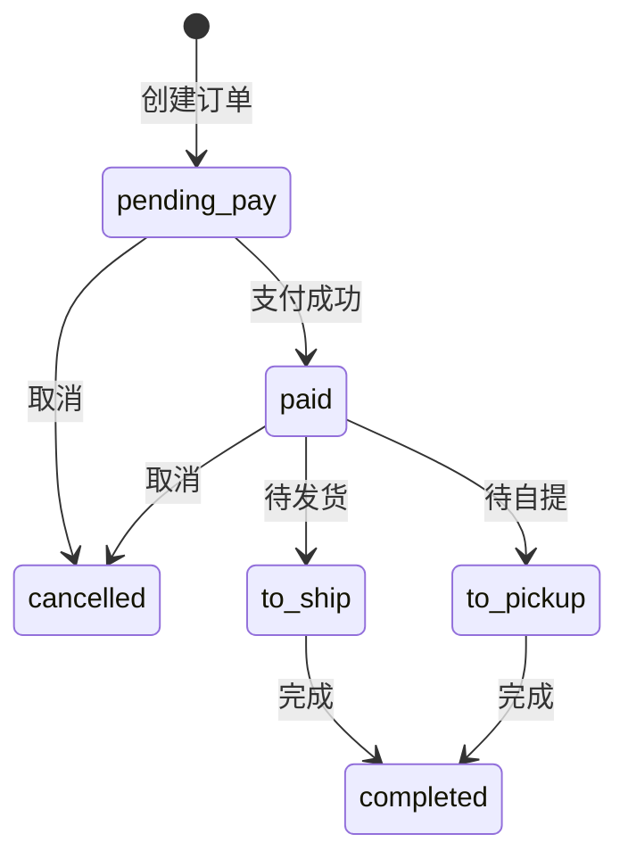
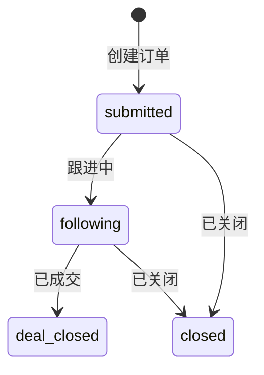
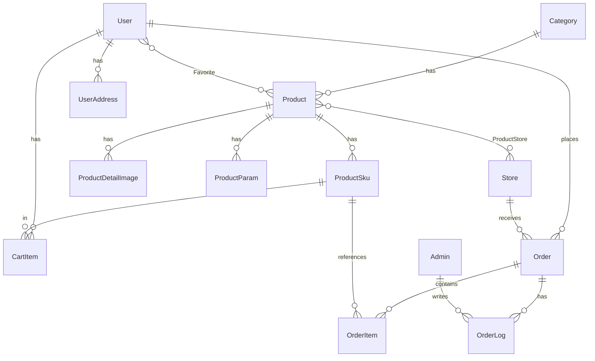

# 布行项目需求说明

> 本文档以当前仓库代码实现为准，描述业务需求与功能边界。环境与启动步骤见根目录 [README.md](../README.md)。

---

## 1. 项目概述

### 1.1 产品定位

**布行（面料）数字化系统**：为面料批发商提供

- **B 端**：Web 管理后台，维护门店、系列、商品、SKU、订单与跟进
- **C 端**：微信小程序，供客户浏览面料、加购、下**布版**或**大货**订单

### 1.2 技术架构

| 子项目 | 技术栈 | 说明 |
|--------|--------|------|
| `admin/` | Vue 3 + Vite + Element Plus + Pinia | 管理后台，Hash 路由 |
| `api/` | Express + Prisma 5 + MySQL | 统一 REST API |
| `mini/` | uni-app Vue 3 + Vite + Pinia | 微信小程序 |

### 1.3 仓库目录

```text
mina/
├── admin/          # 管理后台前端
├── api/            # 后端 API + Prisma
├── mini/           # 微信小程序
├── docs/           # 需求与说明文档（本文件）
├── .env.example    # 环境变量示例
└── README.md       # 快速开始
```

---

## 2. 角色与系统边界

| 角色 | 使用系统 | 主要职责 |
|------|----------|----------|
| **管理员** | 管理后台 | 维护基础数据、处理订单状态与跟进备注 |
| **微信用户** | 小程序 | 浏览商品、收藏、购物车、提交布版/大货订单 |
| **系统服务** | API | 鉴权、数据持久化、图片上传、微信登录与支付（含开发 mock） |

**边界说明**：

- 管理后台接口均需管理员 JWT（`/api/auth/login` 获取）
- 小程序接口使用用户 JWT（`/api/mini/auth/wechat` 获取），目录类接口可匿名访问
- 订单创建、购物车、地址、收藏等写操作需登录

---

## 3. 核心业务概念

### 3.1 门店（Store）

- 字段：名称、联系人、电话、地址、启用状态、排序 `sort`
- 用途：用户下单时选择服务门店；商品通过 `ProductStore` 关联可售门店
- 仅 **enabled** 门店在小程序选店列表中展示

### 3.2 系列（Category）

- 业务上仅使用**一级系列**（`parentId` 为 `null`；库表保留 `parentId` 以备扩展）
- 字段：名称、启用状态、排序 `sort`
- 小程序首页左侧为系列列表，切换后加载该系列下商品

### 3.3 商品（Product）

| 字段/关联 | 说明 |
|-----------|------|
| `code` | 货号 |
| `name` | 名称 |
| `coverImage` | 封面图（相对路径存库） |
| `categoryId` | 所属系列 |
| `enabled` | 上架/下架 |
| `sort` | 同系列内展示顺序 |
| `productStores` | 可售门店多对多 |
| `detailImages` | 详情 Tab 多图 |
| `params` | 参数 Tab（名/值/排序） |
| `skus` | 颜色规格与单价 |

新建商品时可自动创建默认参数项：**幅宽、克重、成分、量化**（值为空，后台可补全）。

### 3.4 SKU（ProductSku）

- `specName`：规格名称（如「1#米黄」）
- `price`：单价，单位 **元/米**（`Decimal`）
- `enabled`、`sort`：是否可售及规格列表顺序
- 布版订单按 **数量 × 单价** 计算 `totalAmount`

### 3.5 订单类型

| 类型 | 代码 | 定价 | 支付 | 履约 |
|------|------|------|------|------|
| **布版** | `sample` | SKU 单价 × 数量 | 在线支付（生产需微信商户号；开发可 mock） | 快递或自提，状态含待发货/待自提 |
| **大货** | `bulk` | 仍按 SKU 单价汇总（展示「大货价格面议」） | `payStatus` 为 `offline`，无在线支付闭环 | 提交后由后台跟进，状态为跟进型 |

购物车、下单、订单列表均按 `orderType` 区分布版与大货，同一 SKU 可分别存在于两种类型的购物车行（`userId + skuId + orderType` 唯一）。

---

## 4. 管理后台功能需求

路由定义见 `admin/src/router/index.js`。

### 4.1 登录

- 用户名 + 密码登录，JWT 存 `sessionStorage`，有效期 2 小时
- 安全策略：同 IP 15 分钟最多 10 次尝试；连续 5 次密码错误锁定 30 分钟
- 默认账号由 seed 创建（见 README，上线前必须修改）

### 4.2 门店管理

- 列表：分页、关键词（名称/联系人/电话）
- 新增/编辑：名称、联系人、电话、地址、启用状态（**无**弹窗内手动排序字段）
- 删除：需确认
- **排序模式**：加载全部门店（含停用），表格拖拽手柄调整顺序，松手调用 `PUT /api/stores/sort` 自动保存

### 4.3 系列管理

- 与门店管理类似：CRUD + **排序模式**（`GET/PUT /api/categories/sort-list|sort`）
- 列表展示关联系列下商品数量

### 4.4 商品管理

**列表页**

- 筛选：系列、货号/名称关键词
- 分页列表；封面缩略图
- 操作：进入详情/SKU、编辑、删除
- **排序模式**：先选系列，加载该系列下全部商品（含下架），拖拽排序后 `PUT /api/products/sort`（body 含 `categoryId`）

**新建/编辑弹窗**

- 系列、货号、名称、封面图上传、上架状态
- 新建时 `sort` 默认为 0；编辑不通过弹窗改排序

**商品详情页**（多 Tab）

| Tab | 功能 |
|-----|------|
| 基本信息 | 货号、名称、系列、关联门店（多选）、上架状态；保存调用 `PUT /products/:id` 与 `PUT /products/:id/stores` |
| 商品详情 | 多图上传；**拖拽排序**；删除单张（`PUT .../detail-images/sort`） |
| 商品参数 | 表格编辑名/值；拖拽排序；「补全默认参数」；「保存参数」批量提交（`PUT .../params/batch`） |
| SKU 规格 | 列表拖拽排序；新增/编辑/删除 SKU（弹窗无排序字段，新建排在末尾） |

### 4.5 订单管理

**列表**

- 筛选：订单类型（布版/大货）、状态、门店、关键词（订单号/客户名/电话）
- 分页展示订单摘要

**详情**

- 展示订单号、类型、门店、客户、金额、支付状态、备注、明细行
- **更新订单状态**：下拉选择该类型允许的状态，`PATCH /api/orders/:id/status`
- **跟进记录**：管理员添加文字备注，写入 `OrderLog` 时间线

### 4.6 图片上传

- `POST /api/upload`，字段 `file`，返回相对路径 `/uploads/...`
- 管理后台展示时用 `resolveMediaUrl` 将相对路径拼为可访问绝对 URL（依赖部署域名或开发环境 API 地址）
- 服务端 multer **无** 2MB 硬限制；生产环境可能仍受 Nginx `client_max_body_size` 约束

---

## 5. 微信小程序功能需求

页面注册见 `mini/src/pages.json`。底部 Tab：**商品**、**购物车**、**我的**。

### 5.1 浏览商品（`pages/index`）

- 左侧：启用中的系列列表（按 `sort`）
- 右侧：当前系列下启用商品网格（按 `sort asc, id desc`），支持关键词搜索、分页加载
- 点击商品进入详情
- 底部有「全部商品 / 主题」文案：**主题仅为 UI 占位**（见第 11 节）

### 5.2 商品详情（`pages/product/detail`）

- 顶部轮播：详情图列表，无详情图时用封面
- 价格展示：板布价格为 SKU 最低价；大货展示「面议」
- Tab：**商品详情**（长图）、**商品参数**（键值表）
- 操作：收藏/取消收藏、分享（微信分享卡片）
- 底部：**加购**、**板布下单**、**大货下单**（弹层选门店、SKU、数量）
- 可选进入门店信息（关联门店）

### 5.3 购物车（`pages/cart/index`）

- 列表按 **布版** / **大货** 分组展示
- 修改数量、删除行
- 分别「布版结算」「大货结算」，打开结算 sheet

### 5.4 结算与下单

**布版结算**

- 选择门店（须可售当前商品）
- 配送：**自提**（默认）或 **快递**（需选择收货地址）
- 提交后订单状态 `pending_pay`，支付状态 `unpaid`
- 开发环境可调用 mock 支付成功接口

**大货结算**

- 选择门店、填写备注等
- 提交后状态 `submitted`，支付状态 `offline`

下单成功后可选清除对应购物车 SKU。

### 5.5 我的（`pages/mine/index`）

- 微信登录（未配置 AppID 时使用 `WECHAT_DEV_OPENID` 开发登录）
- 用户区展示头像、昵称/姓名、脱敏手机号；点击进入个人资料
- **业务入口**：我的订单、我的收藏
- **账户入口**：个人资料、联系地址（微信小程序内调用 `chooseAddress` 并同步至后端收货地址）
- 「管理收货地址」进入自建地址列表（增删改、微信导入、省市区选择器）
- 页脚技术支持文案（统一为「粤企网络技术支持」，见 `mini/src/config.js`）

### 5.6 个人资料（`pages/profile/edit`）

- 字段：姓名（必填）、手机号（必填，支持微信一键填写）、公司名（必填，可填「无」）、公司地址（选填）
- 保存调用 `PUT /mini/auth/profile`；退出登录

### 5.7 我的订单

- 列表可按类型筛选；查看详情（门店、明细、状态、地址快照等）
- 布版订单在待支付状态下可发起支付（生产环境 `uni.requestPayment`）

### 5.8 收货地址

- 列表、新增、编辑、删除
- 省市区（`picker mode="region"`）+ 详细地址、联系人、电话、默认地址
- 微信小程序支持「从微信导入」（`chooseAddress` → `POST /mini/addresses/import`）

### 5.9 我的收藏

- 收藏商品列表，取消收藏，跳转详情

### 5.10 图片 URL

- 小程序接口返回的图片字段经 `API_PUBLIC_URL` 转为**绝对 URL**
- 与管理后台「存相对路径、前端拼接」策略不同，部署时需正确配置 `API_PUBLIC_URL`

---

## 6. 订单与状态机

### 6.1 创建规则

- 必填：`orderType`、`storeId`、`items[]`（`skuId` + `quantity`）
- SKU 须启用且所属商品已上架
- 门店须启用，且与订单内所有商品存在 `ProductStore` 关联
- 布版 + 快递：必须传 `addressId`，地址快照 JSON 存入 `addressSnapshot`
- 生成唯一 `orderNo`；写入 `OrderItem` 快照（规格名、数量、单价）

### 6.2 布版订单状态（`sample`）



| 状态码 | 含义 |
|--------|------|
| `pending_pay` | 待支付 |
| `paid` | 已支付 |
| `to_ship` | 待发货 |
| `to_pickup` | 待自提 |
| `completed` | 已完成 |
| `cancelled` | 已取消 |

### 6.3 大货订单状态（`bulk`）



| 状态码 | 含义 |
|--------|------|
| `submitted` | 已提交 |
| `following` | 跟进中 |
| `deal_closed` | 已成交 |
| `closed` | 已关闭 |

### 6.4 支付状态

| 值 | 含义 | 典型场景 |
|----|------|----------|
| `unpaid` | 未支付 | 布版待支付 |
| `paid` | 已支付 | 布版已付款 |
| `offline` | 线下/无需在线支付 | 大货订单 |

### 6.5 后台状态变更

- 管理员在后台将订单改为上述任一**该类型允许**的状态
- 每次变更写入一条 `OrderLog`（含操作管理员用户名）
- 管理员可额外添加自由文本跟进备注

---

## 7. 排序与展示规则

### 7.1 排序字段

凡带 `sort` 的实体均影响 C 端展示顺序，后台通过 **拖拽** 批量写入连续序号 `0..n-1`。

| 实体 | 后台操作入口 | 小程序影响 |
|------|--------------|------------|
| 系列 | 系列列表 → 排序模式 | 首页左侧系列顺序 |
| 门店 | 门店列表 → 排序模式 | 选门店、目录门店列表 |
| 商品 | 商品列表 → 排序模式（按系列） | 系列下商品网格顺序 |
| 详情图 | 商品详情 → 详情 Tab 拖拽 | 详情 Tab 图片顺序 |
| 参数 | 商品详情 → 参数 Tab 拖拽 | 参数 Tab 行顺序 |
| SKU | 商品详情 → SKU 表拖拽 | 规格选择列表顺序 |

### 7.2 查询排序约定

| 场景 | orderBy |
|------|---------|
| 小程序系列/门店/SKU/详情图/参数 | `sort asc`, `id asc` |
| 小程序商品列表 | `sort asc`, `id desc` |
| 管理端 sort-list | `sort asc`, `id asc` |

### 7.3 启用过滤

- 小程序目录接口仅返回 `enabled: true` 的系列、门店、商品、SKU
- 管理端排序模式拉取**全量**（含停用），以便调整下架项顺序

---

## 8. 数据模型摘要



### 8.1 主要表说明

| 模型 | 表名 | 说明 |
|------|------|------|
| Admin | admins | 后台管理员 |
| LoginAttempt | login_attempts | 登录尝试记录 |
| Store | stores | 门店 |
| Category | categories | 系列 |
| Product | products | 商品 |
| ProductSku | product_skus | SKU |
| ProductStore | product_stores | 商品-门店关联（复合主键） |
| ProductDetailImage | product_detail_images | 详情图 |
| ProductParam | product_params | 商品参数 |
| User | users | 小程序用户（openid） |
| UserAddress | user_addresses | 收货地址 |
| Favorite | favorites | 收藏（复合主键 userId+productId） |
| CartItem | cart_items | 购物车 |
| Order | orders | 订单 |
| OrderItem | order_items | 订单明细 |
| OrderLog | order_logs | 订单跟进日志 |

### 8.2 级联删除

- 删除商品：级联 SKU、详情图、参数、门店关联、收藏
- 删除用户：级联地址、购物车、收藏；订单 `userId` 置空（`SetNull`）
- 删除订单：级联明细与日志

完整字段定义见 `api/prisma/schema.prisma`。

---

## 9. 接口与集成

### 9.1 路由前缀

- 管理端：除 `/api/auth`、`/api/mini/*`、`/api/health` 外，业务路由需 `Authorization: Bearer <admin_token>`
- 小程序：`/api/mini/*`，写操作需用户 token

### 9.2 管理端 API 索引

| 模块 | 路径前缀 | 主要能力 |
|------|----------|----------|
| 认证 | `/api/auth` | login, me, logout |
| 门店 | `/api/stores` | CRUD, sort-list, sort |
| 系列 | `/api/categories` | CRUD, all, sort-list, sort |
| 商品 | `/api/products` | CRUD, sort-list, sort, 门店关联, SKU/详情图/参数子资源 |
| 订单 | `/api/orders` | 列表, 详情, 改状态, 添加日志 |
| 上传 | `/api/upload` | 单文件上传 |

实现文件：`api/src/routes/` 下对应 `*.js`。

### 9.3 小程序 API 索引

| 模块 | 路径前缀 | 主要能力 |
|------|----------|----------|
| 认证 | `/api/mini/auth` | wechat 登录, me, profile, phone（手机号解密） |
| 目录 | `/api/mini/catalog` | categories, products, product 详情, stores |
| 收藏 | `/api/mini/favorites` | 列表, 添加, 删除 |
| 购物车 | `/api/mini/cart` | 列表, 添加, 改数量, 删除 |
| 地址 | `/api/mini/addresses` | CRUD, import（微信地址同步） |
| 订单 | `/api/mini/orders` | 列表, 详情, 创建 |
| 支付 | `/api/mini/pay` | wechat 预支付, mock-success, notify |

### 9.4 环境变量（摘要）

复制 `.env.example` 到 `api/.env`，常用项：

| 变量 | 用途 |
|------|------|
| `DATABASE_URL` | MySQL 连接 |
| `JWT_SECRET` | 管理员 JWT |
| `JWT_USER_SECRET` | 小程序用户 JWT |
| `CORS_ORIGIN` | 管理后台允许的来源（逗号分隔） |
| `API_PUBLIC_URL` | 小程序图片绝对 URL 前缀 |
| `ADMIN_USERNAME` / `ADMIN_PASSWORD` | seed 初始管理员 |
| `WECHAT_APPID` / `WECHAT_SECRET` | 微信登录 |
| `WECHAT_DEV_OPENID` | 本地无 AppID 时模拟 openid |
| `WECHAT_DEV_PHONE` | 本地无 AppID 时模拟一键填写手机号 |
| `WECHAT_MCH_ID` / `WECHAT_PAY_API_KEY` | 微信支付（生产） |

### 9.5 响应格式

统一 JSON：`{ code, data, message }`。`code === 0` 为成功。

---

## 10. 非功能需求

### 10.1 安全

- 管理员密码 bcrypt 存储
- 登录限流与账号锁定（见 4.1）
- 生产环境必须更换 `JWT_SECRET`、`JWT_USER_SECRET` 与默认管理员密码
- CORS 按 `CORS_ORIGIN` 白名单，支持 credentials（勿在 Nginx 对 API 再配 `Access-Control-Allow-Origin: *`）

### 10.2 部署

- 管理后台：构建 `admin/dist`，静态托管；Hash 路由无需服务端 fallback 规则
- API：Node 进程 + MySQL；`npx prisma migrate deploy`
- 建议 Nginx：`/api` 与 `/uploads` 反代到 Node；静态资源单独域名或路径
- 生产 API 示例：`https://api.mina.bigdeng.com/api`；管理后台 `https://admin.mina.bigdeng.com`

### 10.3 可用性

- 健康检查：`GET /api/health`
- 上传目录 `api/uploads` 需持久化或可挂载存储

### 10.4 开发约定

- 小程序开发者工具请求本地 API 建议使用 `127.0.0.1`，避免 `localhost` 解析问题
- 修改 `mini/src/config.js` 后需重新 `npm run build` 再在开发者工具中打开 `dist/build/mp-weixin`

---

## 11. 待做 / 已知限制

以下能力**未实现**或仅为占位，请勿在验收时按「已上线」理解：

| 项 | 说明 |
|----|------|
| 首页「主题」Tab | `mini/src/pages/index.vue` 底部文案存在，无切换逻辑与数据 |
| 生产微信支付 | 需配置商户号与证书；当前开发以 `POST /api/mini/pay/mock-success/:orderId` 为主 |
| 二级系列 | 表结构有 `parentId`，业务与接口均按一级系列处理 |
| 拖拽排序体验 | 无请求失败自动回滚列表、单条数据时无专门提示 |
| 订单列表排序 | 管理端按 `id desc` 时间倒序，非 `sort` 字段 |
| 大货议价 | 前端展示「面议」，后端仍按 SKU 单价汇总 `totalAmount` |

---

## 文档维护

- 功能变更时请同步更新本章与对应代码路径
- 环境与命令以 [README.md](../README.md)、[mini/README.md](../mini/README.md) 为准
